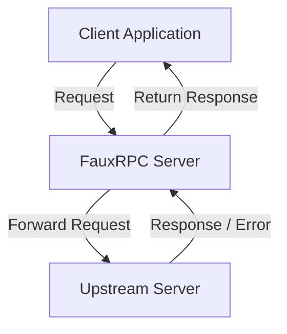

FauxRPC can act as an intercepting proxy that sits between your client application and a real upstream server, and record that traffic to structured stub files for later replay.

These features allow you to seamlessly bridge the gap between real upstream environments and local mock setups, enabling rapid API co-development and automatic test-fixture generation.

---

## 1. Upstream Proxying

FauxRPC can act as an intercepting proxy that sits between your client application and a real/upstream gRPC or Connect server. Instead of manually mock-generating responses for every service, you can delegate requests to an actual upstream instance.

### Architecture



### Usage

To start FauxRPC in proxy mode, pass the `--proxy-to` flag:

```shell
fauxrpc run \
  --schema=buf.build/connectrpc/eliza \
  --proxy-to=127.0.0.1:8080
```

*   **`--proxy-to`**: The network address of the upstream gRPC or Connect server to forward requests to. It supports HTTP/2 and gRPC/Connect framing protocols.

### Under the Hood

1.  **Header Normalization**: When forwarding requests, FauxRPC sanitizes headers to prevent connection corruption. Protocol-specific headers (e.g., keys starting with `grpc-` or `connect-`), end-to-end transport headers (e.g., `connection`, `te`, `trailer`, `host`), and compression headers (`accept-encoding`) are excluded so the internal HTTP client can manage its own lifecycle and transport compression safely.
2.  **Dynamic Client Creation**: FauxRPC dynamically constructs Connect client handlers for the loaded schemas.
3.  **Response Sourcing Header**: Responses successfully proxied from the upstream server will contain the HTTP header:

```http
x-fauxrpc-source: proxy
```

---

## 2. Unimplemented Fallback

In a microservices architecture, upstream endpoints are often under active development. If a client hits an endpoint that has not yet been implemented on the upstream server, the upstream server typically returns an `UNIMPLEMENTED` status code (gRPC code `12`, Connect code `unimplemented`).

To facilitate incremental, parallel development, FauxRPC intercepts these errors and falls back to serving a mock response.

### How it Works

1.  **Interception**: The proxy handler captures all response errors returned by the upstream server.
2.  **Evaluation**: If the error code is `UNIMPLEMENTED`:
    *   FauxRPC checks its internal mock registry for any matching stubs defined for the service and method.
    *   If a matching stub exists, FauxRPC serves the response defined in the stub and attaches the headers:

```http
x-fauxrpc-source: stub
x-fauxrpc-mock-ids: <stub-id-1>,<stub-id-2>
```

    *   If no matching stub is registered, FauxRPC falls back to dynamic faked data generation based on the Protobuf schemas and writes a random payload, attaching the header:

```http
x-fauxrpc-source: fake
```

3.  **Other Errors**: For any error code other than `UNIMPLEMENTED`, the error is passed back to the client as-is.

---

## 3. Structured Stub Recording

Recording traffic is the easiest way to generate deterministic mock profiles (stubs) without writing JSON configurations by hand. 

When recording is enabled alongside proxying, FauxRPC records every request and response passing through it, translates them into the FauxRPC stub schema format, and saves them to your local disk.

### The `--record-dir` Flag

Instead of appending all stubs to a single monolithic file, FauxRPC structures them neatly into a directory hierarchy matching your API's namespaces:

```shell
fauxrpc run \
  --schema=buf.build/connectrpc/eliza \
  --proxy-to=127.0.0.1:8080 \
  --record-dir=stubs/
```

### Folder Structure

Recorded stubs are written to files inside the directory specified by `--record-dir`, using the service name as a subdirectory and the method name as a JSON filename:

```text
stubs/
└── connectrpc.eliza.v1.ElizaService/
    ├── Say.json
    └── Converse.json
```

### Stub File Anatomy

For each recorded RPC, FauxRPC writes a `StubFile` JSON structure containing a list of `stubs`. If a request is made multiple times, the stub entry is appended to the corresponding file.

#### Success Response Stub (`Say.json`)

```json
{
  "stubs": [
    {
      "id": "c1a0172e-d0fe-4cbb-bd31-50e505295c5d",
      "target": "connectrpc.eliza.v1.ElizaService/Say",
      "active_if": "req.sentence == \"Hello Eliza\"",
      "content": {
        "sentence": "Hello! How can I help you today?"
      },
      "priority": 10
    }
  ]
}
```

*   **`id`**: A uniquely generated UUID.
*   **`target`**: The service-to-method target string.
*   **`active_if`**: A conditional Common Expression Language (CEL) expression automatically derived from the request payload fields. If a request is sent with `sentence: "Hello Eliza"`, FauxRPC constructs `req.sentence == "Hello Eliza"` to guarantee that this stub only activates when the exact same input is received.
*   **`content`**: The successful response payload translated to JSON.

#### Error Response Stub

If the upstream server returns a standard error (other than `UNIMPLEMENTED`), FauxRPC records it as an error stub:

```json
{
  "stubs": [
    {
      "id": "e4544d6c-674d-4be9-bde8-b2ef53d4ebad",
      "target": "connectrpc.eliza.v1.ElizaService/Say",
      "active_if": "req.sentence == \"trigger error\"",
      "error_code": 3,
      "error_message": "Invalid request parameter.",
      "priority": 10
    }
  ]
}
```

#### Streaming & Bidirectional Stubs

For server-streaming, client-streaming, or bidirectional streaming RPCs, FauxRPC captures the sequence of messages, along with estimated delays, and packages them in a `stream` block:

```json
{
  "stubs": [
    {
      "id": "ff806148-7d84-4869-90b5-e692cf2659d7",
      "target": "connectrpc.eliza.v1.ElizaService/Converse",
      "active_if": "req.sentence == \"Start stream\"",
      "priority": 10,
      "stream": {
        "items": [
          {
            "content": { "sentence": "Stream response chunk 1" },
            "delay": "100ms"
          },
          {
            "content": { "sentence": "Stream response chunk 2" },
            "delay": "100ms"
          }
        ]
      }
    }
  ]
}
```

---

## 4. Replaying Recorded Stubs

Once you have recorded your stubs into a directory, you can stop the proxy mode and run FauxRPC entirely offline using those recorded files as its backend.

Pass the directory to the `--stubs` flag:

```shell
fauxrpc run \
  --schema=buf.build/connectrpc/eliza \
  --stubs=stubs/
```

FauxRPC recursively walks the `stubs/` directory, detects all `.json` files, and registers every recorded stub. When clients query the server, FauxRPC serves the recorded responses if the incoming request matches the `active_if` rules.
